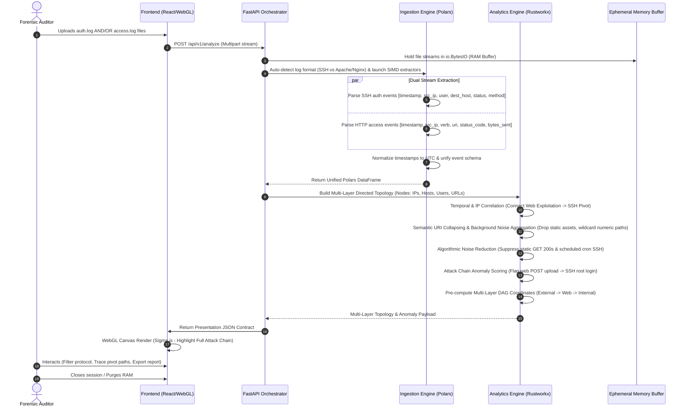

# Vestige - Architecture Specification & Technical Documentation

**System Title:** Vestige: Tactical Ephemeral Visual Forensics for Lateral Movement Detection  
**Author / Architect:** Senior Systems Architect & Digital Forensics Expert  
**Version:** 1.1.0 (Expanded Dual-Log Specification: SSH + HTTP Web Access)  
**Date:** August 2026  

---

## 1. Executive Architecture

Vestige is engineered as a high-throughput, offline-first tactical forensic platform designed to ingest raw Linux authentication logs (`auth.log`) and Web Server Access Logs (Apache/Nginx Combined Format), parse and structure security events, construct directed multi-layer network topology graphs, apply heuristic noise reduction, and render interactively in a WebGL-accelerated browser canvas.

### High-Level Architectural Diagram

```
+-----------------------------------------------------------------------------------+
|                                 PRESENTATION LAYER                                |
|  [ React 18 + Vite ] <---> [ Sigma.js / Graphology WebGL Canvas ] <---> [ Web Worker ] |
+-----------------------------------------------------------------------------------+
                                          ^
                                          | JSON Contract (HTTPS/WebSocket)
                                          v
+-----------------------------------------------------------------------------------+
|                             ORCHESTRATION / API LAYER                             |
|  [ FastAPI (Python 3.11+) ] <---> [ Pydantic v2 Contracts ] <---> [ Ephemeral RAM Buffer ]|
+-----------------------------------------------------------------------------------+
                                          |
                     +--------------------+--------------------+
                     |                                         |
                     v                                         v
+------------------------------------------+ +--------------------------------------+
|          INGESTION / ETL ENGINE          | |        GRAPH ANALYTICS ENGINE        |
|  [ Polars DataFrame (Rust-backed SIMD) ]  | | [ Rustworkx / NetworkX + Scipy ]   |
|  - Dual-Format Streaming Parsers         | | - Multi-Layer Directed Topology     |
|    (Linux auth.log + Apache/Nginx Access)| | - Temporal IP/URL Correlation      |
|  - Normalization & Event Alignment       | | - Attack Chain Anomaly Scoring      |
+------------------------------------------+ +--------------------------------------+
```

### Technology Stack & Technical Justifications

| Layer | Recommended Technology | Technical Justification |
| :--- | :--- | :--- |
| **Presentation Layer** | **React 18 + Vite + TypeScript + Sigma.js / Graphology (WebGL)** | Standard DOM or SVG graph libraries degrade severely when rendering >1,000 nodes/edges. **Sigma.js** uses **WebGL** to maintain 60 FPS performance for multi-layer topologies (IPs, Hosts, Web Endpoints, SSH Sessions). Graphology offloads ForceAtlas2 layout calculations to Web Workers. |
| **Orchestration / API Layer** | **FastAPI (Python 3.11+) + Uvicorn + Pydantic v2** | FastAPI handles dual-format log file uploads asynchronously. Pydantic v2 enforces schema contracts for both HTTP actions and SSH authentication events. |
| **Ingestion / ETL Engine** | **Polars (Rust-backed DataFrame Library)** | Polars parses multi-gigabyte `auth.log` and Nginx/Apache access log files in parallel using Rust SIMD regex extractors, unifying heterogeneous schemas into a normalized event stream 20x–50x faster than Pandas. |
| **Graph Analytics Engine** | **Rustworkx (PyO3/Rust) + NetworkX** | Constructs directed graphs correlating web exploitation vectors (HTTP `POST` / `GET`) with lateral pivot paths (SSH `Accepted` / `Failed`). |

---

## 2. End-to-End Data Flow (Revised Dual-Format Ingestion)

Vestige processes raw logs entirely **in-memory (ephemeral)** without persistent storage. The updated ETL engine supports dual-format ingestion for Linux SSH authentication logs (`auth.log`) and Web Server Access Logs (Apache/Nginx NCSA Combined Format), stitching complete attack chains across web exploitation and SSH lateral movement.



### Detailed Dual-Format Ingestion & Temporal Correlation Sequence

1. **Auto-Detection & Log Router Engine (`LogRouterEngine`):**
   - Inspects the initial 15 line byte headers of uploaded payloads:
     - **Syslog SSH Signature (`SYSLOG_AUTH`):** `sshd\[\d+\]:\s+(Accepted|Failed|Invalid user)` or `pam_unix`
     - **Web Access Signature (`NCSA_ACCESS`):** `HTTP/1.[01]` or `HTTP/2` or `(?P<src_ip>\S+)\s+\S+\s+\S+\s+\[(?P<timestamp>[^\]]+)\]\s+"(?P<verb>[A-Z]+)\s+(?P<uri>\S+)\s+HTTP/[0-9.]+"\s+(?P<status_code>\d+)\s+(?P<bytes_sent>\d+)`
   - Dynamically dispatches stream processing to format-specific SIMD Polars parsers.
2. **Schema Normalization:**
   - Both log streams are mapped to a standardized internal event model:
     - `SSH_AUTH`: `[timestamp, src_ip, target_entity=dest_host, protocol='SSH', verb=auth_method, status=auth_result, detail=user]`
     - `HTTP_REQUEST`: `[timestamp, src_ip, target_entity=url_path, protocol='HTTP', verb=http_verb, status=status_code, detail=uri]`
3. **Temporal & IP-Based Cross-Protocol Correlation:**
   - The engine matches identical `src_ip` values across HTTP access logs and SSH auth logs within a configurable temporal window ($\Delta t \le 300\text{s}$).
   - **Attack Chain Correlation Example:**
     - `198.51.100.42` issues `POST /api/v1/upload` (HTTP `200`) at `03:20:10` to `web-server-01`.
     - At `03:22:15`, `198.51.100.42` (or `web-server-01`) opens an SSH session `Accepted password for root from 10.0.4.15`.
     - The graph stitches a continuous multi-hop attack path:  
       `External Attacker (198.51.100.42)` $\xrightarrow{\text{HTTP POST /upload}}$ `URL Node (/api/v1/upload)` $\xrightarrow{\text{SSH Accepted (root)}}$ `Internal Host (10.0.9.88)`.

---

## 3. Revised Conceptual Data Model

### Entity Definitions & Attributes

#### 1. Node Entity (`Node`)
Represents network endpoints (Hosts, Gateways), identities (User Accounts), or web resources (URLs, Web Servers).

| Attribute | Type | Description |
| :--- | :--- | :--- |
| `id` | `String` | Unique node identifier (e.g. `host:10.0.4.15`, `user:root`, `url:/api/v1/upload`, `web_server:10.0.4.15:80`). |
| `label` | `String` | Display label rendered on canvas (e.g. `/api/v1/upload` or `10.0.4.15`). |
| `node_type` | `Enum` | `HOST`, `JUMPBOX`, `SUBNET_GATEWAY`, `USER_ACCOUNT`, `URL`, `WEB_SERVER`. |
| `in_degree` | `Integer` | Count of incoming SSH connections or HTTP requests. |
| `out_degree` | `Integer` | Count of outgoing SSH pivots or outbound requests. |
| `risk_score` | `Float` | Anomaly score (`0.0` to `10.0`) based on web exploit flags + SSH pivot severity. |
| `first_seen` | `ISO8601 String` | Earliest activity timestamp. |
| `last_seen` | `ISO8601 String` | Latest activity timestamp. |
| `metadata` | `Object` | Additional contextual data (e.g., `uri_path`, `http_methods`, `status_codes`, `is_internal`, `layer`). The `layer` attribute (`external`, `web`, `internal`) explicitly drives the deterministic X-band Multi-Layer layout. |

#### 2. Edge Entity (`Edge`)
Represents aggregated interaction flows between two nodes, supporting both `SSH_AUTH` and `HTTP_REQUEST` protocols.

| Attribute | Type | Description |
| :--- | :--- | :--- |
| `id` | `String` | Unique edge ID (e.g. `edge:198.51.100.42->url:/api/v1/upload`). |
| `source` | `String` | Source Node ID (`host:198.51.100.42`). |
| `target` | `String` | Target Node ID (`url:/api/v1/upload` or `host:10.0.4.15`). |
| `edge_type` | `Enum` | `SSH_AUTH`, `HTTP_REQUEST`. |
| `weight` | `Float` | Anomaly weight driving visual line thickness. |
| `total_attempts` | `Integer` | Total SSH login attempts or total HTTP request count. |
| `http_verb` | `Optional[String]` | HTTP verb (`GET`, `POST`, `PUT`, `DELETE`) for `HTTP_REQUEST` edges. |
| `status_code` | `Optional[Integer]`| Primary HTTP status code (`200`, `403`, `404`, `500`). |
| `uri_path` | `Optional[String]` | Target URI path for web edges. |
| `successful_auths`| `Optional[Integer]`| Count of successful SSH logins (`Accepted`). |
| `failed_auths` | `Optional[Integer]`| Count of failed SSH logins (`Failed`/`Invalid`). |
| `distinct_users` | `List[String]`| List of SSH user accounts used. |
| `is_anomalous` | `Boolean` | `True` if flagged by heuristic rules. |
| `anomaly_flags` | `List[Enum]` | `WEB_EXPLOIT_POST`, `HTTP_4XX_SCAN`, `SSH_PRIVILEGE_PIVOT`, `BRUTE_FORCE_BURST`, `FULL_ATTACK_CHAIN`. |
| `first_timestamp` | `ISO8601 String` | First recorded interaction time. |
| `last_timestamp` | `ISO8601 String` | Last recorded interaction time. |

#### 3. Unified Event Entity (`Event`)
Represents raw log records retained in memory for drill-down inspection.

| Attribute | Type | Description |
| :--- | :--- | :--- |
| `event_id` | `String` | Hash or deterministic UUID. |
| `timestamp` | `ISO8601 String` | Timestamp. |
| `source_ip` | `String` | Source IP address. |
| `protocol` | `Enum` | `SSH`, `HTTP`. |
| `verb` | `String` | HTTP verb (`POST`) or SSH auth method (`publickey`/`password`). |
| `target` | `String` | Target URL path (`/upload`) or Target Hostname (`database01`). |
| `status` | `String` | HTTP Status code (`200`) or SSH result (`SUCCESS`/`FAILURE`). |
| `raw_line` | `String` | Original log line string. |

---

## 4. Presentation Payload (JSON Contract)

The presentation contract returns a unified graph topology representing a complete attack chain: an External Attacker IP (`198.51.100.42`) issuing an HTTP `POST` to a URL Node (`/api/v1/upload`), followed by a lateral SSH pivot to an Internal Host (`10.0.9.88`).

```json
{
  "meta": {
    "session_id": "vestige_sess_web_ssh_correlation",
    "timestamp": "2026-08-06T18:45:00Z",
    "log_filename": "access.log, auth.log",
    "total_lines_parsed": 85400,
    "valid_ssh_events": 12400,
    "valid_http_events": 73000,
    "processing_time_ms": 284.1,
    "noise_reduction_ratio": 0.912
  },
  "summary": {
    "total_nodes": 4,
    "total_edges": 3,
    "anomalous_edges_count": 2,
    "high_risk_nodes_count": 2,
    "detected_lateral_chains": 1
  },
  "graph": {
    "nodes": [
      {
        "id": "host:198.51.100.42",
        "label": "198.51.100.42 (External Attacker)",
        "node_type": "HOST",
        "in_degree": 0,
        "out_degree": 2,
        "risk_score": 8.8,
        "x": -250.0,
        "y": 0.0,
        "size": 20,
        "color": "#EF4444",
        "metadata": {
          "is_internal": false,
          "country": "External",
          "layer": "external"
        }
      },
      {
        "id": "url:/api/v1/upload",
        "label": "POST /api/v1/upload",
        "node_type": "URL",
        "in_degree": 1,
        "out_degree": 1,
        "risk_score": 7.5,
        "x": 500.0,
        "y": -120.0,
        "size": 4.0,
        "color": "#EF4444",
        "metadata": {
          "uri_path": "/api/v1/upload",
          "primary_verb": "POST",
          "layer": "web"
        }
      },
      {
        "id": "host:10.0.4.15",
        "label": "10.0.4.15 (Web Server)",
        "node_type": "WEB_SERVER",
        "in_degree": 1,
        "out_degree": 1,
        "risk_score": 6.2,
        "x": 500.0,
        "y": -40.0,
        "size": 4.0,
        "color": "#EF4444",
        "metadata": {
          "is_internal": true,
          "layer": "web"
        }
      },
      {
        "id": "host:10.0.9.88",
        "label": "10.0.9.88 (Crown Jewel DB)",
        "node_type": "HOST",
        "in_degree": 1,
        "out_degree": 0,
        "risk_score": 9.5,
        "x": 1000.0,
        "y": 80.0,
        "size": 4.0,
        "color": "#DC2626",
        "metadata": {
          "is_internal": true,
          "layer": "internal"
        }
      }
    ],
    "edges": [
      {
        "id": "edge:198.51.100.42->url:/api/v1/upload",
        "source": "host:198.51.100.42",
        "target": "url:/api/v1/upload",
        "edge_type": "HTTP_REQUEST",
        "weight": 3.8,
        "total_attempts": 15,
        "http_verb": "POST",
        "status_code": 200,
        "uri_path": "/api/v1/upload",
        "is_anomalous": true,
        "anomaly_flags": ["WEB_EXPLOIT_POST"],
        "first_timestamp": "2026-08-06T03:20:10Z",
        "last_timestamp": "2026-08-06T03:20:15Z",
        "size": 3.0,
        "color": "#F59E0B",
        "style": "solid"
      },
      {
        "id": "edge:url:/api/v1/upload->host:10.0.4.15",
        "source": "url:/api/v1/upload",
        "target": "host:10.0.4.15",
        "edge_type": "HTTP_REQUEST",
        "weight": 1.0,
        "total_attempts": 15,
        "http_verb": "POST",
        "status_code": 200,
        "uri_path": "/api/v1/upload",
        "is_anomalous": false,
        "anomaly_flags": [],
        "first_timestamp": "2026-08-06T03:20:10Z",
        "last_timestamp": "2026-08-06T03:20:15Z",
        "size": 0.3,
        "color": "rgba(55, 65, 81, 0.03)",
        "style": "solid"
      },
      {
        "id": "edge:198.51.100.42->host:10.0.9.88",
        "source": "host:198.51.100.42",
        "target": "host:10.0.9.88",
        "edge_type": "SSH_AUTH",
        "weight": 5.8,
        "total_attempts": 6,
        "successful_auths": 1,
        "failed_auths": 5,
        "distinct_users": ["root"],
        "is_anomalous": true,
        "anomaly_flags": ["SSH_PRIVILEGE_PIVOT", "FULL_ATTACK_CHAIN"],
        "first_timestamp": "2026-08-06T03:22:15Z",
        "last_timestamp": "2026-08-06T03:25:40Z",
        "size": 3.0,
        "color": "#DC2626",
        "style": "dashed"
      }
    ]
  },
  "timeline": []
}
```

---

## 5. Critical Bottlenecks & Mitigation Strategies

### Bottleneck 1: Heterogeneous Dual-Log Parsing Overhead
- **Risk:** Parsing mixed Nginx/Apache access logs and Linux `auth.log` files simultaneously using standard Python regex could lead to high CPU contention and string parsing latency.
- **Mitigation Strategy:**
  - **Polars Auto-Format Classifier:** Polars inspects initial chunk headers to dispatch specialized Rust-native regex SIMD extractors for SSH vs NCSA Combined Log formats.
  - **Zero-Copy Column Concatenation:** Normalize schemas directly within Polars LazyFrames before executing physical joins or group-by aggregations.

### Bottleneck 2: High Node Density from Unique Web URLs
- **Risk:** High-traffic web servers with thousands of distinct dynamic URLs (e.g. `/item?id=1`, `/item?id=2`) could explode graph node count, degrading WebGL canvas rendering.
- **Mitigation Strategy:**
  - **Aggressive Semantic URI Collapsing:** Heuristically collapse dynamic query parameters, numeric IDs, and UUIDs (replacing with `*`) at ingestion time to prevent node proliferation.
  - **Static Asset Pruning:** Aggressively filter all requests to static extensions (e.g., `.css`, `.js`, `.png`, `.pdf`) regardless of HTTP status code, eliminating noise from browser prefetches and cache hits.
  - **Background Noise Super-Node:** External IPs that act purely as benign browsers (only `GET` requests, no anomalies, no SSH activity) are collapsed into a single `host:background_web_noise` super-node.

### Bottleneck 3: RAM Overconsumption Across Multi-File Uploads
- **Risk:** Storing raw web access logs alongside auth logs in memory during multi-gigabyte forensic sessions can trigger memory allocation limits.
- **Mitigation Strategy:**
  - Aggregated payload contracts return summarized HTTP verb and status code metrics. Raw access log strings are fetched on demand via paginated query endpoints, maintaining an ephemeral zero-footprint architecture.

### Bottleneck 4: Visual Clutter in Dense Graphs
- **Risk:** Even after noise reduction, visualizing 5,000+ nodes using standard force-directed gravity physics creates an illegible "hairball" topology where critical attack chains are buried.
- **Mitigation Strategy:**
  - **Multi-Layer (DAG) Kill-Chain Layout:** Node positions are assigned deterministically into constrained X-band columns (External IPs at X=0, Web Layer at X=500, Internal Hosts at X=1000) grouped and sorted by `risk_score`. ForceAtlas2 is strictly optional.
  - **Opacity and Z-Index Prioritization:** Standard connections (benign traffic) are rendered extremely thin (size 0.3) and nearly invisible (0.03 alpha). Anomalous links are assigned thick, solid neon lines (size 3.0) and pushed to the top z-index layer (`zIndex=2`) to immediately draw auditor focus.
  - **Aggressive Label Culling:** Labels are strictly hidden by default (`labelRenderedSizeThreshold=8`) and only appear selectively on hover or deep zoom.

---
